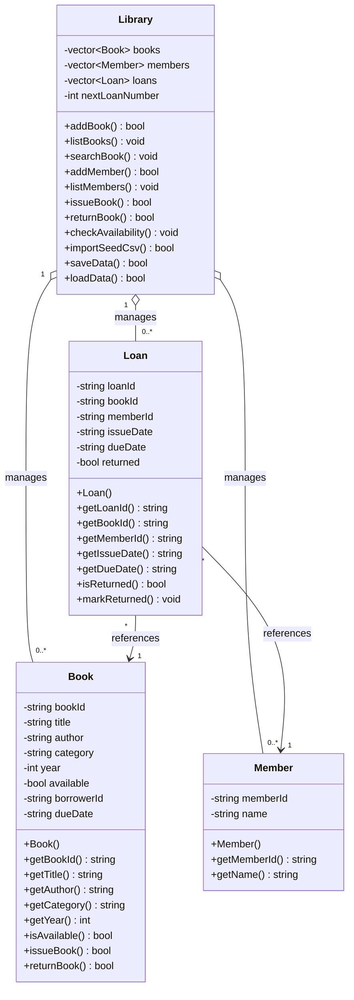

# Library Manager – Class Diagram

```mermaid
classDiagram
    class Book {
        -string bookId
        -string title
        -string author
        -string category
        -int year
        -bool available
        -string borrowerId
        -string dueDate
        +Book()
        +getBookId() string
        +getTitle() string
        +getAuthor() string
        +getCategory() string
        +getYear() int
        +isAvailable() bool
        +issueBook() bool
        +returnBook() bool
    }

    class Member {
        -string memberId
        -string name
        +Member()
        +getMemberId() string
        +getName() string
    }

    class Loan {
        -string loanId
        -string bookId
        -string memberId
        -string issueDate
        -string dueDate
        -bool returned
        +Loan()
        +getLoanId() string
        +getBookId() string
        +getMemberId() string
        +getIssueDate() string
        +getDueDate() string
        +isReturned() bool
        +markReturned() void
    }

    class Library {
        -vector~Book~ books
        -vector~Member~ members
        -vector~Loan~ loans
        -int nextLoanNumber
        +addBook() bool
        +listBooks() void
        +searchBook() void
        +addMember() bool
        +listMembers() void
        +issueBook() bool
        +returnBook() bool
        +checkAvailability() void
        +importSeedCsv() bool
        +saveData() bool
        +loadData() bool
    }

    Library "1" o-- "0..*" Book : manages
    Library "1" o-- "0..*" Member : manages
    Library "1" o-- "0..*" Loan : manages
    Loan "*" --> "1" Book : references
    Loan "*" --> "1" Member : references
```